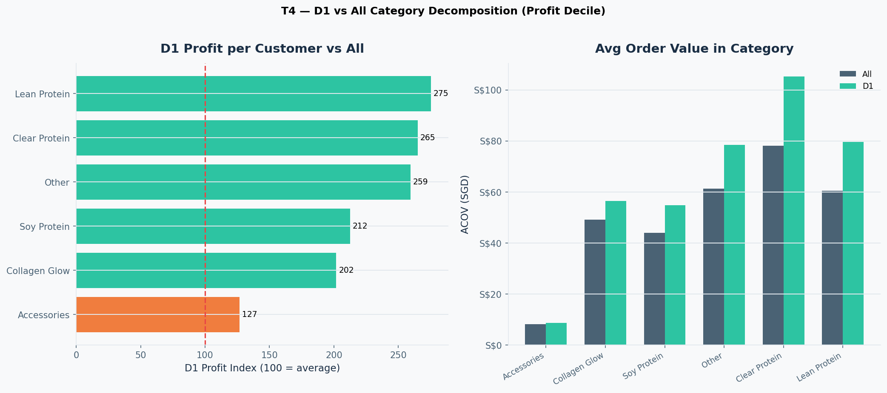

# Actionable Insights — Decile × Category Analysis

**Pool:** 4,290 customers | **Profit proxy:** 40% margin | **Years:** 2022–2025

---

## 1. Protect and grow profit D1 — they are a different species (T1)

- **D1 profit decile** averages **S$228** profit vs **S$4** for D10 — a **61×** gap.
- D1 buys **4.2×** more often (4.2 vs 1.0 orders) but the bigger lever is **$/unit**: **S$53** vs **S$3** (17×).
- D1 explores **2.3** categories vs D10's **1.6** — breadth AND premium basket composition drive value.

**Actions:**
- VIP programme for profit D1 (early access, bundles, subscription nudges).
- Upsell to **larger packs / hero proteins** — don't discount D1; they already pay premium $/unit.
- Do NOT treat D10 one-time buyers with the same promo intensity as D1.

---

## 2. Frequency D1 ≠ Profit D1 — target both explicitly (T1 compare)

- **Frequency D1** averages **5.1 orders** but only **S$164** profit — high engagement without highest spend.
- **Profit D1** has fewer orders (4.2) but **higher AOV** (S$134 vs S$81).

**Actions:**
- **Frequency D1:** subscription conversion, replenishment reminders (54-day reorder window from prior SKU analysis).
- **Profit D1:** premium bundles, multi-category baskets, avoid margin-eroding discounts.
- Use `is_top_both` flag in `customers_decile_table.csv` (~244 customers) as **true VIP** tier.

---

## 3. Cross-sell is the retention engine (T3 + T5)

- Profit D1 Clear Protein buyers: only **10%** are sole-category — most cross-shop.
- D1 cumulative categories grew **1.2 → 2.2** (+1.0) from 2022 to 2025 — breadth develops over time, not just at acquisition.

**Actions:**
- **Year 1→2 cross-sell window:** email lean/clear buyers with complementary category (Collagen, Soy) within 60 days of 2nd order.
- Post-purchase flows: 'Customers who bought Clear also bought Lean' — only **10%** stay in one category.
- Incentivise **2nd category by order 3**, not just 2nd order.

---

## T4 — D1 vs All Category Decomposition (Profit Decile)

| Category | % Active (All / D1) | ACOF (All / D1) | ACOV (All / D1) | Units/Order (All / D1) | $/Unit (All / D1) | Margin (All / D1) | $/Cust Profit (All / D1) | Index | Share (All / D1) |
|---|---|---|---|---|---|---|---|---|---|
| Lean Protein | 26.8% / 30% | 0.3 / 0.6 | $60 / $80 | 1.5 / 1.5 | $40 / $54 | 40% / 40% | $32 / $88 | 275 | 22.5% / 19.9% |
| Clear Protein | 31.8% / 34% | 0.2 / 0.5 | $78 / $105 | 1.5 / 1.7 | $52 / $63 | 40% / 40% | $39 / $104 | 265 | 32.5% / 27.0% |
| Other | 32.1% / 52% | 0.3 / 0.6 | $61 / $78 | 1.6 / 2.0 | $38 / $40 | 40% / 40% | $38 / $98 | 259 | 31.8% / 38.5% |
| Soy Protein | 4.5% / 7% | 0.3 / 0.5 | $44 / $55 | 1.4 / 1.7 | $32 / $33 | 40% / 40% | $25 / $52 | 212 | 2.9% / 2.7% |
| Collagen Glow | 9.6% / 22% | 0.3 / 0.6 | $49 / $57 | 1.5 / 1.7 | $34 / $33 | 40% / 40% | $33 / $67 | 202 | 8.4% / 11.1% |
| Accessories | 20.8% / 24% | 0.2 / 0.3 | $8 / $9 | 1.1 / 1.1 | $8 / $8 | 40% / 40% | $4 / $4 | 127 | 1.9% / 0.8% |

*Index = D1 profit per customer ÷ All profit per customer × 100 (100 = pool average). Share = category % of total profit among mapped categories. Unknown excluded. Profit proxy: 40% margin · 4,290 customers · profit decile.*

---

## 4. Prioritise hero proteins in D1 strategy (T4)

- **Lean Protein:** D1 index **275** | D1 ACOV S$80 vs All S$60 | D1 penetration 30% vs 27%
- **Clear Protein:** D1 index **265** | D1 ACOV S$105 vs All S$78 | D1 penetration 34% vs 32%
- **Other:** D1 index **259** | D1 ACOV S$78 vs All S$61 | D1 penetration 52% vs 32%

**Actions:**
- Feature **Lean + Clear** in acquisition creative and landing pages (highest D1 profit density).
- Accessories alone are low profit density (index ~127) — use as **cart add-on**, not acquisition lead.
- Bundle Clear + Lean for D1-leaning customers at checkout.

---

## 5. Steer acquisition by first-transaction category (T9)

- **Collagen Glow** first-tx entrants: VTD index **111**, avg VTD S$57, n=327
- **Other** first-tx entrants: VTD index **98**, avg VTD S$50, n=1,162

**Actions:**
- **Collagen Glow** first-buyers over-index on lifetime value (index ~171) — treat as VIP onboarding despite smaller volume.
- **Accessories-first** entrants index below average (~68) — upsell to protein within 30 days.
- Channel mix: track which acquisition sources produce Collagen/Clear first-tx (personalise welcome series).

---

## 6. Retain active protein buyers year-over-year (T7 + T8)

- **Clear Protein** D1 active rate: 0% (2022) → 22% (2025) — change +22pp
- **Lean Protein** D1 active rate: 0% → 23% — change +23pp
- **Unknown** category shows sharp active decline for D1 — fix product handle mapping in `00_config.py` to sharpen targeting.

**Actions:**
- **Reactivation campaigns** for D1 customers who bought Clear/Lean in 2024 but not 2025.
- Flavour rotation emails for D1 (Peach, White Grape, Thai Milk Tea) to maintain active engagement.
- Monitor **active** not just cumulative — a customer who tried 4 categories but only buys 1 per year still needs stimulation.

---

## 7. Data quality actions (enables sharper insights)

- **~28% Unknown category** distorts T4/T9 — extend `PRODUCT_MAP` in `00_config.py` and request COGS from LP (`deliverables/COGS_Data_Request_LushProtein.xlsx`).
- Once COGS received: re-run profit deciles on **true gross profit** — Accessories margin may differ from 40% assumption.

---

## 8. Priority action matrix

| Priority | Segment | Action | Expected impact |
|----------|---------|--------|-----------------|
| P0 | `is_top_both` (~244) | VIP + subscription + exclusive bundles | Protect highest LTV |
| P0 | Profit D1, not Freq D1 | Premium upsell, limit deep discounts | Raise $/unit |
| P1 | Freq D1 | Replenishment + subscribe-and-save | Raise order frequency |
| P1 | Collagen first-tx | VIP onboarding, cross-sell proteins | Higher VTD index |
| P2 | D5–D7 middle deciles | 2nd-category incentive by order 3 | Move toward D1 breadth |
| P2 | Accessories acquirers | Protein upsell within 30 days | Lift from index ~68 |
| P3 | D10 one-and-done | Low-cost win-back only if recent | Low ROI — deprioritise |

---

Regenerate: `python EDA/category_analysis/plot_decile_category_analysis.py`