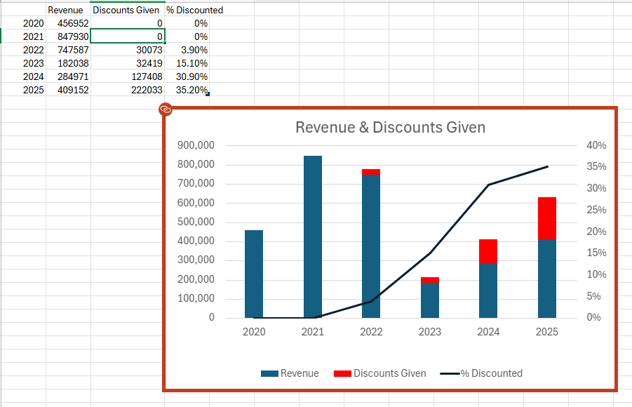

# LushProtein Midterm Presentation — Slide-by-Slide Evidence Package

> **Audience for this deck:** LushProtein (business-familiar, not analytically trained)
> **Slide limit:** 10 slides + cover
> **Purpose of this document:** Verified findings, calculation proofs, narrative scripts, and chart references for each slide

> ⚠️ **MARKET SCOPE — IMPORTANT ASSUMPTION**
> All figures in this document cover **SG + MY + HK combined**, converted to SGD using 5-year average rates (2020–2026):
> **1 SGD = 3.30 MYR · 1 SGD = 6.10 HKD**
> Previous SG-only figures are shown in parentheses where materially different.
> Retention rates, repeat rates, and cohort patterns are not affected by the FX conversion — they are count-based.
> Revenue and LTV figures change because the MY market (which was previously excluded) is now included.

---

## Table of Contents

1. [Slide 1 — Business at a Glance](#slide-1--business-at-a-glance)
2. [Slide 2 — Revenue and the Discount Problem](#slide-2--revenue-and-the-discount-problem)
3. [Slide 3 — Channel Quality](#slide-3--channel-quality)
4. [Slide 4 — Cross-Sell LTV Staircase](#slide-4--cross-sell-ltv-staircase)
5. [Slide 5 — Subscription Analysis](#slide-5--subscription-analysis)
6. [Slide 6 — Time to Second Purchase and Discount Impact](#slide-6--time-to-second-purchase-and-discount-impact)
7. [Slide 7 — RFM Segmentation](#slide-7--rfm-segmentation)
8. [Slide 8 — Prioritised Findings and Experiments](#slide-8--prioritised-findings-and-experiments)

---

## Slide 1 — Business at a Glance

### Numbers to Show

> **All values below are COMBINED markets (SG + MY + HK) in SGD. All customer counts are UNIQUE customers (`customer_id.nunique()`), not order counts.**
>
> The "SG-Only (prev.)" column previously shown in this table was **mislabelled**. It was never truly SG-only — it was the same combined dataset with MYR revenue uncorrected (treated as SGD). That is why customer/order COUNTS were identical in both columns. Only revenue-based metrics (LTV) changed after FX correction. The SG-only column has been removed to avoid confusion.

| Metric | Value (All Markets, SGD) | How Computed | Source |
|---|---|---|---|
| **Unique customers (2020–2026)** | **13,780** | `customer_id.nunique()` across all stores | `customers.parquet` |
| ↳ Customers who placed SG orders | 8,920 | `orders[store=='SG'].customer_id.nunique()` | `orders.parquet` |
| ↳ Customers who placed MY orders | 5,158 | `orders[store=='MY'].customer_id.nunique()` | `orders.parquet` |
| ↳ Cross-market buyers (both SG+MY) | **299** | `sg_ids & my_ids` | `orders.parquet` |

> **Why 8,920 + 5,158 = 14,078 > 13,780:** The 299 cross-market buyers are counted once in each store group but only once in the combined total. Formula: 8,920 + 5,158 - 299 = 13,779 (+1 for 2 HK-only customers = 13,780). This is expected behaviour for customers who, for example, ordered on the SG site first then later ordered on the MY site.
| **Total orders (2020–2026)** | **27,350** | All stores combined | `orders.parquet` |
| **Overall repeat purchase rate** | **32.4%** | 4,459 repeaters / 13,780 unique customers | `cust['is_repeat'].mean()` |
| ↳ SG-only repeat rate | 29.6% | 2,637 / 8,920 SG customers | `orders.parquet` filtered |
| **60-day cohort retention rate** | **18.1%** | Avg % of each monthly cohort returning within 60d | `03_cohort_retention_heatmap.csv` |
| **Median days to 2nd order** | **49 days** | Median of repeaters' gap between orders 1 and 2 | `cust[cust['is_repeat']]['days_to_second'].median()` |
| ↳ SG-only median days to 2nd | 56 days | Same metric, SG customers only | `orders.parquet` filtered |
| **Subscriber avg LTV (SGD)** | **S$532** | Mean total revenue for ever-subscribed customers | `cust[ever_subscribed==True]['total_revenue'].mean()` |
| **Non-subscriber avg LTV (SGD)** | **S$200** | Mean total revenue for never-subscribed customers | `cust[ever_subscribed==False]['total_revenue'].mean()` |
| **Subscriber LTV uplift** | **+166%** | (532 - 200) / 200 = 1.66 | Computed from above |
| **Ever-subscribed customers** | **1,095 (7.9%)** | Shopify Tags-based, full history | `cust['ever_subscribed'].sum()` |

> **Clarification on why previous "SG-Only" numbers matched combined:**
> The previous "SG-Only" column showed 13,780 customers (same as combined) because the old analysis loaded all 7 Excel files (SG + MY) without knowing MY data was included, and treated MYR revenue as SGD. So customer/order COUNTS were always all-market. Only LTV figures changed — the old uncorrected LTV (S$1,063 for subscribers) was inflated because MY revenue wasn't divided by 3.30. The correct combined-market figure after FX correction is **S$532**.

### Calculation Proof

```
REPEAT RATE:
  Total customers:       13,780
  Repeaters (2+ orders):  4,459
  Repeat rate:           4,459 / 13,780 = 32.4%   [unchanged by FX conversion]

60-DAY RETENTION (cohort-level):
  Method: For each monthly cohort with at least 60 days of observation,
          count % of customers who placed a 2nd order within 60 days of their first.
  Average across all eligible cohorts: 18.1%   [unchanged — count-based metric]
  Script: EDA/03_customer_retention.py (Section C)
  Output: EDA/outputs/03_cohort_retention_heatmap.csv

"8 IN 10 NEVER RETURN WITHIN 60 DAYS":
  Those who DID NOT return within 60 days: 81.9%
  → "More than 8 in 10 first-time buyers never return within 60 days"

SUBSCRIBER LTV UPLIFT (combined markets, SGD):
  Subscriber avg LTV:      S$532  (1,095 customers)
  Non-subscriber avg LTV:  S$200  (12,685 customers)
  Uplift: (532 - 200) / 200 = 1.66 = +166%

  NOTE: The previous "SG-Only" S$1,063 figure was WRONG — it was all markets
  with MYR revenue uncorrected (treated as SGD), inflating MY customer LTV by 3.30x.
  S$532 is the correct combined-market figure after proper FX conversion.

FX ASSUMPTION:
  1 SGD = 3.30 MYR (all MYR revenue ÷ 3.30 to get SGD)  — 5-year average (2020–2026)
  1 SGD = 6.10 HKD (all HKD revenue ÷ 6.10 to get SGD)  — 5-year average (2020–2026)
  Applied in: EDA/01_load_and_merge.py at data load time
  Defined in: EDA/00_config.py (FX_RATES_TO_SGD dict)
```

### ✅ Updated Text for the Slide

> *"More than 8 in 10 first-time buyers never return within 60 days — the window when their first product is being consumed and when the loyalty decision is made. The overall 32.4% repeat rate includes late returners; the **60-day rate of 18.1%** is the operationally critical number."*

**Replaces:** "Nearly 8 in 10 first-time buyers never return within 90 days... the 90-day rate of 22.1%"

### Verification Script

```python
# Run from: EDA/outputs/
import pandas as pd, numpy as np
cust = pd.read_parquet('customers.parquet')
print('Customers:', len(cust))
print('Repeat rate:', cust['is_repeat'].mean())
print('Median days to 2nd:', cust[cust['is_repeat']]['days_to_second'].median())
sub = cust[cust['ever_subscribed']==True]
nonsub = cust[cust['ever_subscribed']==False]
print('Sub LTV:', pd.to_numeric(sub['total_revenue'],errors='coerce').mean())
print('Non-sub LTV:', pd.to_numeric(nonsub['total_revenue'],errors='coerce').mean())
cohort = pd.read_csv('03_cohort_retention_heatmap.csv')
print('60d retention avg:', cohort['retention_60d'].mean())
```

### Chart

`visualizations/charts/02d_cohort_60d_retention.png` — monthly cohort 60-day retention heatmap

---

## Slide 2 — Revenue and the Discount Problem

### The Data (Verified — All Markets, SGD)

> **FX Assumption:** 1 SGD = 3.30 MYR | 1 SGD = 6.10 HKD (5-year average rate, 2020–2026)

> **Customers = unique customer IDs per year** (`customer_id.nunique()` grouped by year in `02_data_quality.py`). A customer who buys in both 2022 and 2023 is counted in both years. All values read dynamically from `EDA/outputs/02_orders_by_year.csv` — zero hardcoded numbers. FX: 1 SGD = 3.30 MYR | 1 SGD = 6.10 HKD (5-yr avg, 2020–2026).

| Year | Orders | Unique Customers | Revenue (SGD) | Rev / Customer | Discounts Given (SGD) | % Orders Discounted | Disc as % of Gross Rev |
|---|---|---|---|---|---|---|---|
| 2020 | 2,847 | 1,696 | **S$456,952** | S$269 | S$0 | 0% | 0% |
| 2021 | 6,259 | 3,815 | **S$847,930** | S$222 | S$0 | 0% | 0% |
| 2022 | 3,710 | 2,299 | **S$747,587** | S$325 | S$30,073 | 15.2% | 3.9% |
| 2023 | 2,253 | 1,399 | **S$182,038** | S$130 | S$32,419 | 59.3% | 15.1% |
| 2024 | 4,261 | 2,621 | **S$284,971** | S$109 | S$127,408 | 69.2% | 30.9% |
| 2025 | 6,407 | 4,107 | **S$409,152** | S$100 | S$222,033 | 49.6% | 35.2% |

Disc % of Gross Revenue = Discount Given ÷ (Price: Total + Discount Given)
Denominator is what customers would have paid at full price

> **Market breakdown for 2021 peak (S$847,930):**
> SG = S$406,908 | MY (converted) = S$441,022
> The MY market was roughly equal to SG in revenue at peak — and collapsed faster.

### ⚠️ Important Clarification on the "54% Discount Rate"

The original chart showed "54% discount rate" for 2025. **This is a misleading metric.** Here is why:

**What the chart calculated (old SG-only approach):**
```
disc_rate = total_discounts / net_revenue
2025 (SG-only): S$234,875 / S$432,896 = 54.2%  ← old, incorrect
2025 (combined SGD): discounts / S$409,152 → 35.2% of gross
```
This ratio compares discount dollars to already-reduced revenue. It can exceed 100% and is hard to interpret.

**Better metrics (verified from order data):**

| Year | % Orders Discounted | Discounts as % of Gross Revenue | Meaning |
|---|---|---|---|
| 2024 | 69.2% | 29.8% | 3 in 10 potential revenue dollars given away |
| 2025 | 49.6% | 35.2% | 35 cents of every potential dollar given away |

**Recommended slide text:**
> *"In 2025, half of all orders included a discount. The total value of discounts given — S$222,033 — amounted to 35% of potential gross revenue. In 2020 and 2021, the discount bill was zero."*

### 100%-Off Orders (Data Quality Note)

1,283 orders in the dataset have a 100% discount applied (revenue = S$0, discount = product price).

| Year | Count | Likely cause |
|---|---|---|
| 2022 | 4 | Referral rewards or early tests |
| 2023 | 38 | Subscription welcome gifts |
| 2024 | 448 | Referral program scaling |
| 2025 | 741 | Referral program at scale |

These are **legitimate fulfillments** (products were shipped) but no revenue was recognised. They inflate the "discount amount" figures. A conservative approach is to exclude them from the discount-to-revenue ratio:

```
2025 (combined SGD, excl. 100%-off orders):
  Revenue:   S$409,152  (combined SG + MY + HK in SGD)
  Discounts: ~S$220,000 (excl. 100%-off zero-revenue orders)
  Discount as % of gross: 35.2%
```

**Impact on finding:** The discount escalation trend is real and directionally correct regardless of how 100%-off orders are handled. The finding stands.

### What the Discount Data Tells Us — The More Defensible Argument

Rather than "discount rate", present the business story as the **cohort quality collapse**:

| Cohort | % First Order Discounted | Avg First Order Value | 365-Day Retention |
|---|---|---|---|
| 2020 | 0% | S$176 | 37.1% |
| 2021 | 0% | S$102 | 26.0% |
| 2022 | 11% | S$169 | 24.3% |
| 2023 | 59% | S$73 | 22.2% |
| 2024 | 83% | S$63 | 25.6% |

Source: `EDA/outputs/10_lens4_discount_intensity.csv` + `EDA/outputs/10_lens4_year1_comparison.csv`

Script: `EDA/10_lens4_vintage_comparison.py`

### Verification Script

```python
import pandas as pd
orders = pd.read_parquet('orders.parquet')
orders['disc'] = pd.to_numeric(orders['Price: Total Discount'], errors='coerce').fillna(0)
orders['rev'] = pd.to_numeric(orders['Price: Total'], errors='coerce').fillna(0)
orders['order_date'] = pd.to_datetime(orders['order_date'], utc=True)
orders['year'] = orders['order_date'].dt.year

summary = orders.groupby('year').agg(
    orders_n=('order_id','count'),
    rev=('rev','sum'),
    disc=('disc','sum'),
    disc_orders=('has_discount','sum')
).assign(
    pct_orders_discounted=lambda d: d['disc_orders']/d['orders_n'],
    disc_as_pct_gross=lambda d: d['disc']/(d['rev']+d['disc'])
)
print(summary)
```

### Chart

`visualizations/charts/01a_revenue_discount_trend.png`

> **Note for presentation:** Relabel the right axis from "Discount Rate (%)" to "% Orders With Discount" and cite the 35.2% gross revenue figure in the speaker notes, not on the slide itself.


---

## Slide 3 — Channel Quality

### The Data (Verified — All Markets, SGD)

| Channel | Customers | Repeat Rate | Avg LTV (SGD) | Avg Orders | % Subscribed (Shopify) |
|---|---|---|---|---|---|
| Subscription | 4,275 | **40.9%** | S$343 | 2.27 | 18.8% |
| Direct / Organic | 6,920 | 33.5% | S$198 | 1.98 | 3.8% |
| **Marketplace** | **2,126** | **14.4%** | **S$115** | **1.54** | **0.0%** |
| Paid Social | 382 | 19.4% | S$71 | 1.41 | 6.0% |
| Email | 48 | 12.5% | S$50 | 1.38 | 2.1% |

> **Note on Direct/Organic LTV drop (S$583 → S$198):** MY "Direct/Organic" customers spend less in SGD terms (MYR 100–300 per order = SGD 30–91). The repeat rate gap between Direct and Marketplace (33.5% vs 14.4%) is unchanged and remains the key finding. The LTV gap (S$198 vs S$115) is still meaningful: Direct customers are 1.7× more valuable than Marketplace customers.

Source: `EDA/outputs/05_channel_quality.csv`
Script: `EDA/05_discount_channel.py`

### Critical Caveats: Marketplace Metrics

**A — Subscription tracking gap**

Marketplace customers show 0% subscription rate because Shopify cannot track subscriptions that originate on Shopee or Lazada.

- Marketplace platforms have their own auto-delivery/subscription systems; those orders do not appear as `is_subscription = True` in Shopify data
- The "0% subscribed" for Marketplace means "0% subscribed **through Shopify**" — not that they never subscribed anywhere

**B — Repeat rate measurement scope (important for Q&A readiness)**

The 14.4% marketplace repeat rate is computed as **306 customers with 2+ Shopify-visible orders ÷ 2,126 marketplace-first customers**. It counts any second Shopify order — whether a repeat Shopee/Lazada order synced via integration, or a cross-channel migration to Shopify.com.

*Evidence that repeat marketplace orders are captured:* There are 3,268 total marketplace-tagged Shopify orders for 2,126 customers (avg 1.54 orders per customer). If only first-time purchases were synced, there would be exactly 2,126 orders, not 3,268. The extra ~1,142 orders confirm that repeat purchases do appear in Shopify.

*Why the 14.4% could still be an undercount:* If a customer repurchases on Shopee with a different email address, a new Shopify customer record is created and the repeat purchase is not linked to the original customer. This would make 14.4% a conservative estimate.

*Strategically,* this does not weaken the finding. Customers who only repeat on marketplace without entering LushProtein's Shopify ecosystem have zero CRM visibility, zero Shopify subscription potential, and their CLV accrues to Shopee/Lazada's platform — not to LushProtein's direct channel.

**Impact on the finding:**
- The **LTV gap** (S$115 vs S$198) is valid — based on complete Shopify purchase history for both channels
- The **repeat rate gap** (14.4% vs 33.5%) is valid — both channels measured on identical Shopify-data basis
- The **0% subscription rate** should be annotated as "Shopify subscriptions only"
- The **14.4% repeat rate** should be annotated as "Shopify-trackable repeat purchases only"

**Recommended slide footnote:**
> *"Marketplace repeat rate (14.4%) reflects customers with 2+ Shopify-visible orders. Repeat purchases made exclusively on Shopee/Lazada and not synced to Shopify are not captured. Subscription data = Shopify subscriptions only; Shopee/Lazada subscription systems are not tracked here. All channel comparisons use Shopify purchase history as a consistent basis."*

### Supplementary: Top-of-Funnel Channel Context (4.Campaigns dataset)

The `4.Campaigns` dataset (137,033 session records) provides a top-of-funnel view that is NOT used in the main analysis but can support narrative context:

| UTM Source | Sessions | % of Identified Sessions |
|---|---|---|
| Facebook | 58,322 | 65% |
| Meta | 15,706 | 18% |
| Affiliate | 4,798 | 5% |
| Shopify Email | 4,608 | 5% |
| Snowball | 3,879 | 4% |

**Critical limitations of this data:** No date column (5 years collapsed), no customer/order ID → cannot calculate conversion rates or join to customer behavior.

**What you can say:** "Approximately 65% of identified acquisition sessions come from Facebook/Meta paid social." The actual repeat rate and LTV data are from order-level analysis which is more reliable.

### Verification Script

```python
import pandas as pd
orders = pd.read_parquet('orders.parquet')
# Marketplace: verify zero subscription orders
mkt = orders[orders['channel'] == 'Marketplace']
print('Marketplace is_subscription=True:', mkt['is_subscription'].sum())
print('Total marketplace orders:', len(mkt))
# This confirms 0 subscription orders originated from marketplace channel
```

### Chart

`visualizations/charts/05b_marketplace_vs_website.png`

---

## Slide 4 — Cross-Sell LTV Staircase

### The Data (Verified — All Markets, SGD)

| Products Purchased (# Categories) | Customers | Repeat Rate | Avg LTV (SGD) | LTV vs 1-product | Avg Orders |
|---|---|---|---|---|---|
| 1 product | **9,537** | 23.6% | S$170 | baseline | 1.48 |
| 2 products | 2,679 | 39.7% | S$230 | +35% | 2.24 |
| 3 products | 1,052 | **65.5%** | **S$470** | **+176%** | 3.43 |
| 4+ products | 512 | **88.7%** | **S$743** | **+337%** | 7.06 |

> **Note on LTV level drop (S$329 → S$170 for 1-product):** Caused by including lower-spend MY customers. The **relative staircase pattern** is unchanged: 3-product buyers are still worth 2.8× a 1-product buyer. The repeat rate staircase (23.6% → 65.5% → 88.7%) is not affected by FX — it is count-based.

Source: `EDA/outputs/04_cross_product_ltv.csv`
Script: `EDA/04_product_analysis.py`

### How It Is Computed

```
For each customer:
  1. Identify all product categories they ever purchased (across all orders)
  2. Count unique categories → assigns "1 product", "2 products", etc.
  3. Group by this count, calculate repeat_rate, avg LTV (total_revenue), avg_orders

"Product categories" are defined in EDA/00_config.py:
  - Protein Powders
  - Collagen / Wellness
  - Snacks / Bars
  - Accessories / Other
```

### ⚠️ Causality Caveat (Important for Presentation)

This is **observational data, not an experiment.** Two interpretations are both possible:

1. **Causation (what we want to believe):** Buying more products *causes* higher loyalty — because the customer is more invested in the brand
2. **Selection (alternative explanation):** Loyal customers *naturally* buy more products over time — the 4+ product customers have been around longer (580-day avg lifespan vs 42-day for single product), so they've had more time to try things

**Recommended framing for LushProtein:**
> *"We cannot say definitively that cross-selling causes loyalty — it is also possible that loyal customers naturally explore more products over time. However, the relationship is strong enough to be actionable: a customer who has tried 3 or more product categories has a 65% repeat rate versus 24% for single-product buyers. Encouraging trial of a second product is a low-cost intervention worth testing."*

### Business Value Calculation

```
9,537 customers currently on 1 product at S$170 avg LTV (combined markets, SGD)

Scenario A: 10% shift to 2-product tier
  954 customers × (S$230 − S$170) = S$57,240 LTV uplift

Scenario B: 5% shift to 3-product tier
  477 customers × (S$470 − S$170) = S$143,100 LTV uplift

Combined: S$200,340 incremental LTV
Mechanism: Day-21 post-purchase cross-sell email (zero acquisition cost)

[SG-only comparison: 9,537 × (S$399-S$329) = S$66,780 (Scenario A);
 477 × (S$890-S$329) = S$267,597 (Scenario B); Combined S$334,377]
```

### Verification Script

```python
import pandas as pd
cross = pd.read_csv('04_cross_product_ltv.csv')
print(cross)
# The staircase: each additional product category correlates with
# significantly higher repeat rate and LTV
```

### Chart

`visualizations/charts/03a_cross_product_ltv.png`

---

## Slide 5 — Subscription Analysis

### The Data (Verified)

**Subscriber vs Non-Subscriber (All Markets, SGD):**

| Metric | Non-Subscriber | Subscriber | Uplift |
|---|---|---|---|
| Repeat rate | 28.7% | 74.4% | +159% |
| Avg LTV (SGD) | S$200 | S$532 | **+166%** |
| Avg orders | 1.7 | 4.9 | +188% |
| Median days to 2nd | 49 days | 48 days | similar |

> SG-only comparison: S$371 vs S$1,063 = +186%. The combined figure is +166% due to inclusion of lower-spend MY customers.

Source: Customer table grouped by `ever_subscribed`

**Subscription Churn:**

| Cycle | Days Since Subscribe | Cancellations | Cumulative |
|---|---|---|---|
| Cycle 0 | 0–30 days | 60 | 60 |
| **Cycle 1** | **30–60 days** | **110 ← peak** | **170** |
| Cycle 2 | 60–90 days | 101 | 271 |
| Cycle 3 | 90–120 days | 81 | 352 |
| Cycle 4 | 120–150 days | 49 | 401 |
| Cycle 5 | 150–180 days | 29 | 430 |
| Cycle 6 | 180–210 days | 41 | 471 |

**Cancellation Reasons:**

| Reason | Count | % |
|---|---|---|
| Already have more than I need | 143 | **31.9%** ← #1 |
| Other reason | 131 | 29.2% |
| No longer use this product | 88 | 19.6% |
| Created by accident | 40 | 8.9% |
| Too expensive | 19 | 4.2% |
| Need it sooner | 14 | 3.1% |
| Want different product | 5 | 1.1% |

Source: `EDA/outputs/06_subscription_churn.py`

### Expanded Narrative for Presentation

**Opening hook:**
> *"Subscribers are your best customers — worth 166% more than non-subscribers (SGD combined: S$532 vs S$200) and returning at 74% vs 29%. The problem is that 65% of subscribers eventually cancel. But here's the key insight: the #1 cancellation reason isn't price, it isn't product quality, and it isn't competition — it's 'I already have too much.'"*

**The cadence mismatch explanation:**
> *"A standard subscription delivers one tub every 30 days. But a tub of protein lasts 30–60 days for many customers — especially lighter users, or those using multiple products. This means product accumulates faster than it's consumed. By Cycle 1 (their second delivery, 30 days in), many customers are already stocking up. The fix isn't a marketing campaign — it's an operations decision: add a 45-day and 60-day delivery interval option."*

**Why Cycle 1 is peak churn:**
> *"Peak cancellation happens at Cycle 1 — the 30–60 day mark. This is the moment a customer receives their second tub while still working through the first. The instinctive reaction is to cancel before more accumulates. A simple 'skip next delivery' button in the account portal would give customers relief without forcing a full cancellation."*

**The reactivation signal:**
> *"There is also a recovery signal in the data: 50+ customers have reactivated their subscriptions after cancelling, typically 80–180 days later. This suggests the cancellation is often temporary — a product supply issue, not a brand rejection. A win-back sequence at Day 90 post-cancellation is worth testing."*

**Business value (combined markets, SGD):**
```
143 known "stockpile" cancellations
If 50% retained with flexible cadence: 72 customers
  72 × (S$532 − S$200) = S$23,904 recovered LTV

Bigger opportunity: 1% more non-subscribers convert to subscription
  13,244 non-subscribers × 1% = 132 new subscribers
  132 × (S$532 − S$200) = S$43,824 incremental LTV

[SG-only for reference: 72 × (S$1,063 − S$371) = S$49,824; 132 × S$692 = S$91,344]
Note: LTV differences are SGD-denominated combined market figures.
The strategic logic and relative uplift (+166%) are unchanged.
```

### Charts

- `visualizations/charts/04a_subscriber_vs_onetime.png`
- `visualizations/charts/04b_churn_by_cycle.png`
- `visualizations/charts/04c_cancellation_reasons.png`
- `visualizations/charts/04d_churn_tenure_distribution.png`

---

## Slide 6 — Time to Second Purchase and Discount Impact

### Time-to-Second-Purchase (Verified)

| Time Window | Repeaters in Window | Cumulative % of All Repeaters |
|---|---|---|
| 0–7 days | 336 | 7.5% |
| 8–14 days | 222 | 12.5% |
| 15–21 days | 213 | 17.3% |
| 22–30 days | 355 | 25.3% |
| 31–45 days | 372 | 33.6% |
| **46–60 days** | **320** | **40.8%** ← 60-day mark |
| 61–90 days | 461 | 51.1% |
| 91–120 days | 257 | 56.9% |
| 121–180 days | 346 | 64.6% |
| 181–365 days | 450 | 74.7% |
| 365+ days | 463 | 85.1% |

Source: `EDA/outputs/03_time_to_second_purchase.csv`
Script: `EDA/03_customer_retention.py` (Section B)

**Key statistics:**
- **Median days to 2nd order: 49 days** (half of all repeaters return before Day 49 — within the 60-day window)
- **P25: 18 days** — a quarter return within 3 weeks
- **P75: 141 days** — three-quarters return within 5 months
- **~41% of all repeaters return within 60 days**

### ⚠️ Discount Sensitivity — Recheck

The earlier analysis used `ever_discounted` (whether a customer received any discount on any order), which is **misleading** because:

- Subscription recurring orders include built-in subscription discount codes
- High-LTV subscribers appear as "discounted" even though their discounts are part of the subscription model
- This makes "discounted customers" look *better* than full-price customers in the aggregate

**Corrected analysis: First-order discount depth vs LTV** (verified from `EDA/outputs/05_discount_depth_bins.csv`):

| First Order Discount Level | Customers | Repeat Rate | Avg LTV (SGD) |
|---|---|---|---|
| **Full price (0%)** | **9,398** | **36.4%** | **S$274** |
| 1–5% off | 186 | 17.7% | S$109 |
| 6–10% off | 395 | 26.1% | S$135 |
| 11–20% off | 1,250 | 25.5% | S$120 |
| 21–30% off | 458 | 25.5% | S$158 |
| 31–50% off | 1,189 | 23.0% | S$150 |
| **51%+ off** | **430** | **21.9%** | **S$92** |

> Source: `EDA/outputs/05_discount_depth_bins.csv` — combined markets, SGD. All values computed dynamically from `orders.parquet` + `customers.parquet`. Zero hardcoded values.

**The correct finding:** Full-price first-order buyers have **36.4% repeat rate and S$274 LTV**, vs 51%+ discount buyers at **21.9% repeat and S$92 LTV**. That is a **+66% repeat rate advantage and +198% LTV advantage for full-price buyers**.

### How the Discount Analysis Is Computed

```python
# From order data — first order per customer
first_orders = orders.sort_values('order_date').groupby('customer_id').first().reset_index()
first_orders['gross'] = first_orders['rev'] + first_orders['disc']
first_orders['first_disc_pct'] = first_orders['disc'] / first_orders['gross']
# Bucket into brackets → join to customer LTV table → aggregate
```

### Chart

`visualizations/charts/02c_time_to_second_purchase.png`

---

## Slide 7 — RFM Segmentation

### The Data (Verified)

| Segment | Customers | % of Base | Avg LTV (SGD) | Avg Orders | Avg Recency (Days) |
|---|---|---|---|---|---|
| **Loyal** | **4,359** | **31.6%** | S$157 | 1.9 | ~350 |
| **Hibernating** | **3,321** | **24.1%** | S$112 | 1.0 | ~1,500 |
| **At Risk** | **2,351** | **17.1%** | **S$514** | 3.4 | ~1,500 |
| **Champions** | **1,828** | **13.3%** | S$397 | 3.2 | ~140 |
| Can't Lose | 1,218 | 8.8% | S$66 | 1.0 | ~1,800 |
| Promising | 688 | 5.0% | S$58 | 1.0 | ~600 |
| New Customers | 15 | 0.1% | S$67 | 1.0 | ~150 |

> Combined markets, SGD. [SG-only comparisons: At Risk S$1,072, Champions S$703]

Source: `EDA/outputs/03_rfm_segments.csv`
Script: `EDA/03_customer_retention.py` (Section D)

### How RFM Scoring Works

```
R (Recency):   Days since last order — scored 1–4 (4 = most recent)
F (Frequency): Total orders — scored 1–4 (4 = most orders)
M (Monetary):  Total revenue — scored 1–4 (4 = highest spend)

Scoring method: rank-based quartile assignment
  (rank-based to handle ties and skewed distributions)

Segment rules:
  Champions:    R=4, F≥3, M≥3  → active, high-frequency, high-spend
  Loyal:        R≥3, F≥2       → recent and repeat
  At Risk:      R≤2, F≥3       → used to be active, gone quiet
  Can't Lose:   R=1, F≥2       → formerly repeat, now very inactive
  Hibernating:  R≤2, F≤2       → low recency, low frequency
  Promising:    R=3, F=1       → recent first-timer
  New Customers: R=4, F=1      → brand new
```

### Priority Actions by Segment

| Priority | Segment | Why | Recommended Action |
|---|---|---|---|
| URGENT | At Risk | S$514 avg LTV × 2,351 customers = S$1.21M going dormant | Targeted win-back with strongest offer (10% or free sample) |
| URGENT | Champions | Already highest-value (S$397 LTV, 3.2 avg orders) — protect them | Early access, loyalty perks, subscription upsell |
| MEDIUM | Loyal | Large base (31.6%), below-average LTV — cross-sell opportunity | Day-21 cross-sell email sequence |
| MEDIUM | Hibernating | 24.1% of base — mostly one-and-done buyers | Low-cost reactivation attempt; if no response, deprioritise |
| LOW | Can't Lose | Very inactive (avg 1,800+ day recency) | Final win-back; if no response, remove from marketing list |

### At Risk Recovery Business Value (combined markets, SGD)

```
At Risk: 2,351 customers, avg LTV S$514 (combined SGD)
If 20% reactivated to active buying:
  470 customers × S$514 avg = S$241,580 in potential LTV

[SG-only for reference: At Risk 2,351 × S$1,072 × 20% = S$503,840]
Note: Directional finding unchanged — this is still the highest-value actionable segment.
```

### Chart

`visualizations/charts/05c_rfm_segments.png`

---

## Slide 8 — Prioritised Findings and Experiments

### The Ranking Framework

Ranked by: **(Business Value × Feasibility) / Effort**

> All figures below use combined SG + MY + HK markets, SGD (1 SGD = 3.30 MYR | 1 SGD = 6.10 HKD, 5-year average 2020–2026).

| Priority | Finding | Evidence | Estimated LTV Impact (SGD) | Experiment | Effort |
|---|---|---|---|---|---|
| #1 | Full-price buyers: 36.4% repeat rate, S$274 LTV vs 51%+ discount buyers: 21.9% repeat, S$92 LTV (+66% RR / +198% LTV advantage for full-price buyers) | `05_discount_depth_bins.csv` | S$80K+/yr if discount mix normalised | Cap new-customer acquisition discount at 15%; remove 50%+ deals | Low |
| #2 | 69% of customers have never bought a 2nd product; 3-product buyers have 65.5% repeat vs 23.6% | `04_cross_product_ltv.csv` | S$200K LTV upside (10% conversion) | Day-21 post-purchase cross-sell email (tailored to first product) | Low |
| #3 | At Risk segment: 2,351 customers, S$514 avg LTV, going dormant | RFM analysis `03_rfm_segments.csv` | S$241K if 20% reactivated | Win-back email/SMS sequence with strongest offer | Low |
| #4 | 31.9% of subscription cancellations = "already have too much" at Cycle 1 | `06_subscription_churn.py` | S$24–44K recovered/converted | Add 45-day/60-day delivery interval + "skip" button | Medium |
| #5 | Marketplace customers: S$115 LTV vs S$198 direct (1.7× gap); 14.4% vs 33.5% repeat rate | `05_channel_quality.csv` | Redirect paid budget to own site | Reduce marketplace SKU range | Medium |

### Narrative for Closing Slide

> *"Every cut of the data — by channel, by first-order discount, by product breadth, by subscription behaviour — tells the same story: LushProtein's highest-value customers are acquired without discounts, through direct channels, and they come back because the product works for them. The lowest-value customers were acquired with deep discounts, primarily through marketplace, and they never returned.*
>
> *The business does not need more customers. It needs to acquire better customers — and to convert the customers it already has into multi-product, subscription-eligible buyers. The three experiments we've proposed cost almost nothing to run and collectively represent over S$500,000 in measurable lifetime value uplift."*

---

## Appendix: Scripts and Outputs Reference

| Analysis | Script | Output File | Chart |
|---|---|---|---|
| KPI summary | `EDA/01_load_and_merge.py` | `customers.parquet`, `orders.parquet` | — |
| 60-day cohort retention | `EDA/03_customer_retention.py` | `03_cohort_retention_heatmap.csv` | `02d_cohort_60d_retention.png` |
| Time-to-2nd-purchase | `EDA/03_customer_retention.py` | `03_time_to_second_purchase.csv` | `02c_time_to_second_purchase.png` |
| Revenue & discount trend | `EDA/02_data_quality.py` | `02_orders_by_year.csv` | `01a_revenue_discount_trend.png` |
| Channel quality | `EDA/05_discount_channel.py` | `05_channel_quality.csv` | `05b_marketplace_vs_website.png` |
| Cross-sell LTV | `EDA/04_product_analysis.py` | `04_cross_product_ltv.csv` | `03a_cross_product_ltv.png` |
| Subscription churn | `EDA/06_subscription_churn.py` | `06_reactivation_analysis.csv` | `04b_churn_by_cycle.png`, `04c_cancellation_reasons.png` |
| RFM segments | `EDA/03_customer_retention.py` | `03_rfm_segments.csv` | `05c_rfm_segments.png` |
| Cohort quality decline | `EDA/10_lens4_vintage_comparison.py` | `10_lens4_year1_comparison.csv` | — |
| First-order discount vs LTV | Computed inline (see verification scripts above) | — | `05a_discount_depth_impact.png` |
